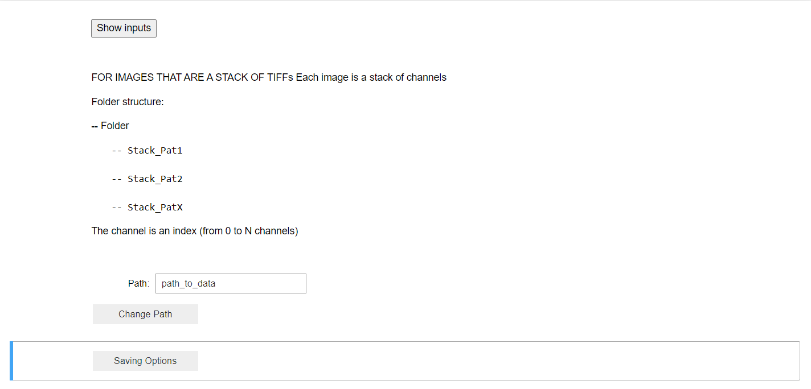
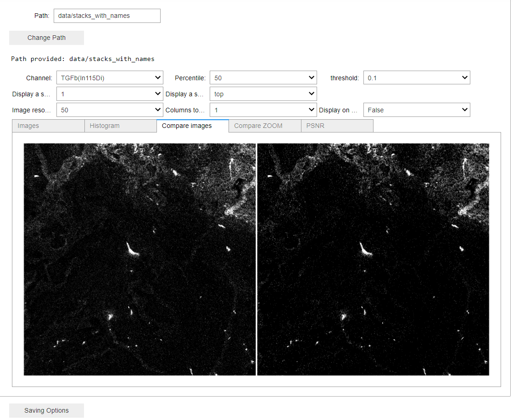
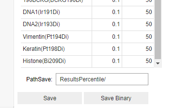

[//]: # ([![License]&#40;https://img.shields.io/badge/license-MIT-blue.svg&#41;]&#40;LICENSE&#41;)
[](https://www.gnu.org/licenses/gpl-3.0)
[](https://github.com/marta-seq/PENGUIN)
[](https://www.python.org/downloads/)
[](CONTRIBUTING.md)
[](https://github.com/marta-seq/PENGUIN/releases/)
# PENGUIN

*PENGUIN* - Percentile Normalization GUI Image deNoising is a 
rapid and efficient image preprocessing pipeline for multiplexed spatial proteomics.
In comparison to existing approaches, PENGUIN stands out by eliminating the need 
for manual annotation or machine learning model training. 
It effectively preserves signal intensity differences and reduces noise.

PENGUIN's simplicity, speed,
and user-friendly interface, deployed both as script and as a Jupyter
notebook, facilitate parameter testing and image processing.

This repository contains the files for running PENGUIN and the comparison
with standard image processing methods and solutions designed 
specifically for multiplex imaging data. 


General view: 


## Table of Contents
- [Clone the Repository](#clone-the-repository)
- [Requirements/Installation](#requirements)
- [Getting started](#getting-started)
- [Credits](#credits)
- [License](#license)
- [Contributing](#contributing)


## Clone the Repository
To clone this repository to your local machine, use the following command:

~~~~~~~~~~~~~
git clone https://github.com/your_username/your_repository.git
~~~~~~~~~~~~~

## Requirements/Installation

You can create the environment installing the packages or using the ymal file. 

To manually create and install packages use: 

```bash
conda create --name penguin
conda activate penguin
conda install matplotlib pandas panel opencv scikit-image ipywidgets jupyter ipykernel plotly
pip install apeer-ometiff-library --no-deps
```

Alternatively, you can create the environemtn using the yml file:

```bash
conda env create --file penguin_env.yml
conda activate penguin
pip install apeer-ometiff-library --no-deps
```

After you created the environment, and if you want to use the Jupyter notebooks

add the environment kernel to jupyter 

```bash
python -m ipykernel install --user --name=penguin
```
launch the jupyter and be sure that you are running with the penguin kernel
If you have problems with widgets appearing in Jupyter notebook try downgrade Ipython version,
for example: 

```bash
python pip install iPython==8.20.0
```

## Getting started

There are 2 Notebooks available. 

Use check_th_all_ch_per_image if each FOV is a stack of channels.

Use check_th_one_ch_per_image if each FOV is a directory with multiple tiffs inside ( one per each channel)

Open the notebook and click Kernel -> Restart and Run all 
For all channels in a stack it should look like this: 


change the path to the location of your data and click 'Change Path' 
You can now change the channels to visualize,
select different percentiles and thresholds. 
Compare images tab gives you the comparison between raw and the clean image with the defined settings
Compare Zoom plots the images using Plotly library that allows for zooming some areas. 
You can change the number of images that are displayed. 

In the case of stacks of channels, your channel names should be in the page tags. Otherwise, the channel names will be
set as index numbers. 
In the case of directory with multiple files, the channel names should be in the file names. 




Once you have the values for percentile and thresholds defined you can 
save your images by just clicking the save button. 
In case of a file per channel, you can save all the images of the same 
channel at once. 
In case of stacks with multiple channels per FOV, you need to define
the values per each channel in the pop up table and click save (see below). 



Saving images will mimick your structure and filenames (and pagetags) in the
saving directory. 


You can also use directly PENGUIN functions. Just check pipeline files. 


## Credits
If you find this repository useful in your research or for educational purposes please refer to:
Sequeira, A. M., Ijsselsteijn, M. E., Rocha, M., & de Miranda, N. F. (2024). PENGUIN: a rapid and efficient image 
preprocessing tool for multiplexed spatial proteomics. Computational and Structural Biotechnology Journal, 23, 3920-3928.
doi:https://doi.org/10.1016/j.csbj.2024.10.048 


## License

Developed at the Leiden University Medical Centre, The Netherlands and 
Centre of Biological Engineering, University of Minho, Portugal

Released under the GNU Public License (version 3.0).


[//]: # (.. |License| image:: https://img.shields.io/badge/license-GPL%20v3.0-blue.svg)

[//]: # (   :target: https://opensource.org/licenses/GPL-3.0)

[//]: # (.. |PyPI version| image:: https://badge.fury.io/py/propythia.svg)

[//]: # (   :target: https://badge.fury.io/py/propythia)

[//]: # (.. |RTD version| image:: https://readthedocs.org/projects/propythia/badge/?version=latest&style=plastic)

[//]: # (   :target: https://propythia.readthedocs.io/)
